```markdown
# Synapse

<p align="center">
  <a href="LICENSE"></a>
  <a href="#"></a>
  <a href="#"></a>
</p>

<p align="center">
  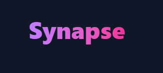
</p>

<section>
  <h2 align="center">Welcome to <em>Synapse</em></h2>
  <p align="center">Synapse bridges connections with real‑time chat, AI‑powered photo analysis, trend insights, and personalized analytics—all wrapped in a sleek, responsive interface. Dive in to experience seamless communication, intelligent interactions, and data‑driven decisions.</p>
</section>

<details open>
  <summary>📑 Table of Contents</summary>
  1. [Features](#-features)  
  2. [Tech Stack](#-tech-stack)  
  3. [Demo](#-demo)   
  4. [Installation](#-installation)  
  5. [Env Variables](#-env-variables)  
  6. [Running the App](#-running-the-app)  
  7. [Folder Structure](#-folder-structure)  
  8. [Contributing](#-contributing)  
  9. [License](#-license)  
</details>

---

## 🚀 Features

<ul>
  <li>🔐 <strong>Secure Auth</strong>: JWT + Google reCAPTCHA v2</li>
  <li>💬 <strong>Real‑time Chat</strong>: 1:1 & group via Socket.io</li>
  <li>🤖 <strong>AI Chatbot</strong>: GPT‑powered contextual conversations</li>
  <li>🖼️ <strong>DeepFace Analysis</strong>: Photo face recognition & attributes</li>
  <li>📈 <strong>Analytics</strong>: Recharts dashboard</li>
  <li>🌐 <strong>i18n</strong>: Multi‑language via i18next</li>
  <li>🎨 <strong>Theme Toggle</strong>: Persistent dark/light mode</li>
  <li>📬 <strong>Password Reset</strong>: Email workflow</li>
  <li>⚡️ <strong>PWA Ready</strong>: Offline caching & SEO</li>
</ul>

---

## 🛠 Tech Stack

<table>
  <tr><th>Layer</th><th>Technology</th></tr>
  <tr><td>Frontend</td><td>React · Tailwind · Vite · Axios · react-hot-toast · Framer Motion · FontAwesome</td></tr>
  <tr><td>Backend</td><td>Node.js · Express · Socket.io</td></tr>
  <tr><td>AI</td><td>OpenAI GPT · DeepFace.js</td></tr>
  <tr><td>DB</td><td>MongoDB · Mongoose</td></tr>
  <tr><td>Auth</td><td>JWT · Google reCAPTCHA</td></tr>
  <tr><td>Charts</td><td>Recharts · react-countup</td></tr>
  <tr><td>i18n</td><td>i18next · react-i18next</td></tr>
  <tr><td>Deploy</td><td>Vercel · Render</td></tr>
</table>

---

## 🎬 Demo

<p align="center">
  <a href="https://synapse-gold.vercel.app">Synapse Live Demo</a>
</p>

<p align="center">
  
</p>

---

## 📸 Screenshots

Here are snapshots of the Synapse web interface:

<table>
  <tr>
    <td align="center">
      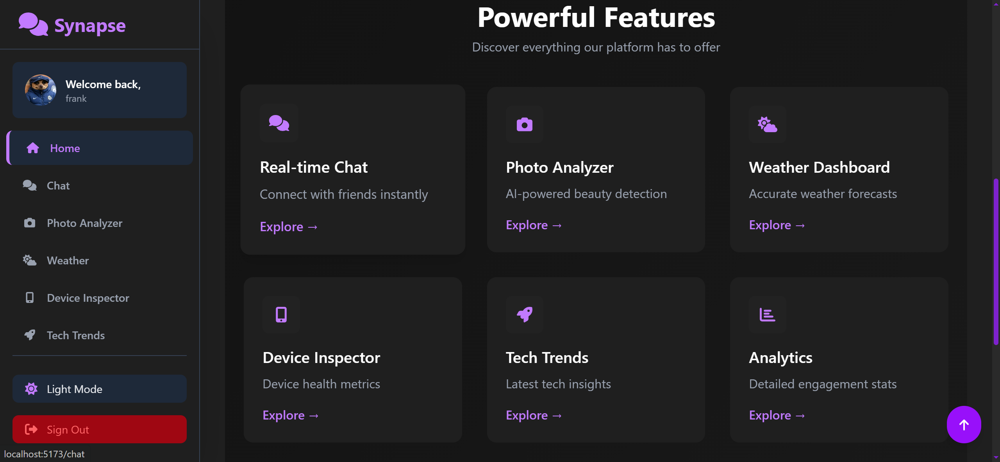<br/>
      <strong>Home Dashboard</strong>
    </td>
    <td align="center">
      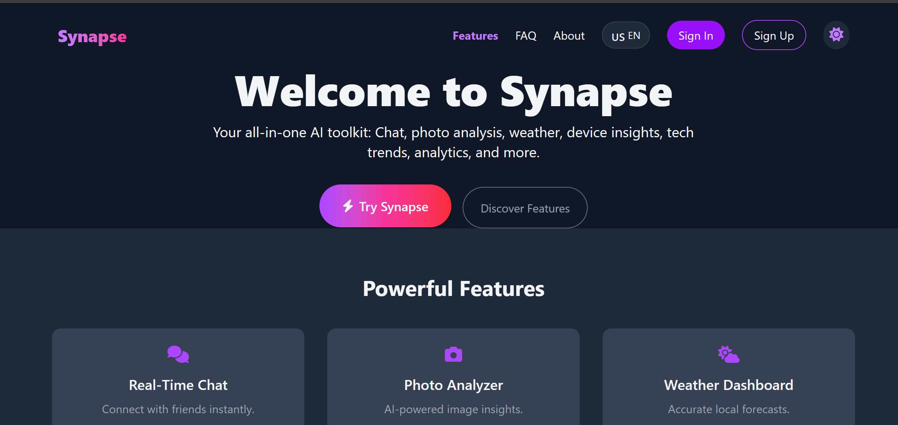<br/>
      <strong>Landing Page</strong>
    </td>
  </tr>
  <tr>
    <td align="center">
      <br/>
      <strong>Login</strong>
    </td>
    <td align="center">
      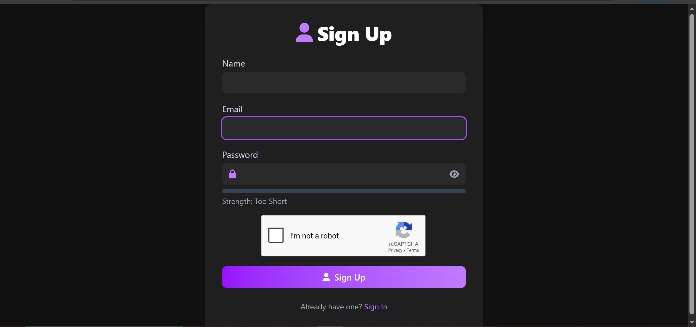<br/>
      <strong>Analytics</strong>
    </td>
  </tr>
  </tr>
  <tr>
    <td align="center">
      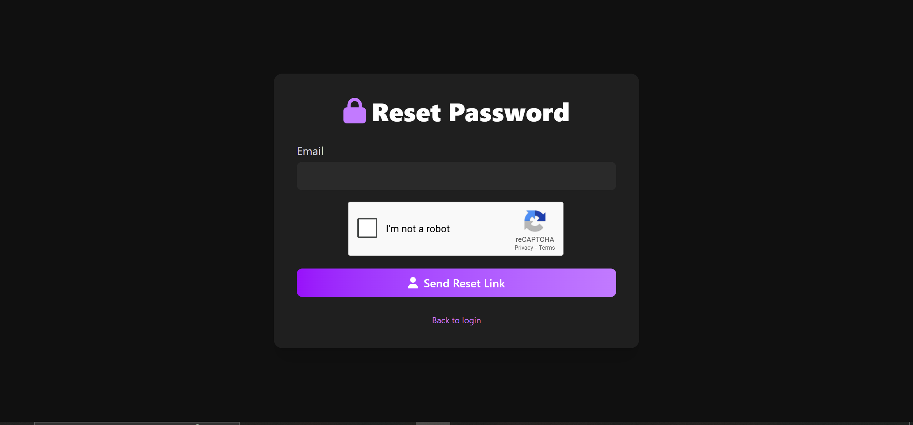<br/>
      <strong>Reset</strong>
    </td>
    <td align="center">
      <br/>
      <strong>Footer</strong>
    </td>
  </tr>
  </tr>
  <tr>
    <td align="center">
      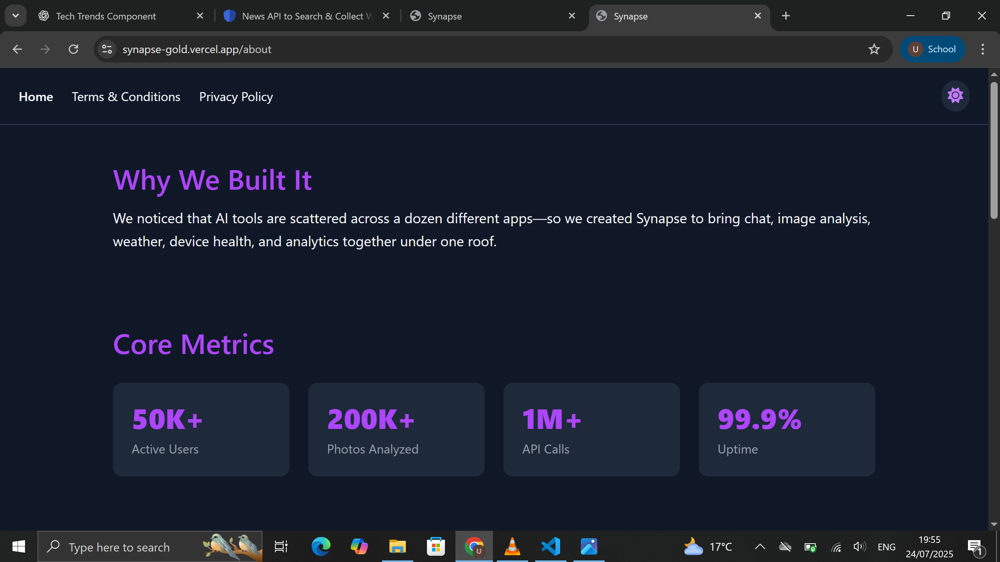<br/>
      <strong>About</strong>
    </td>
    <td align="center">
      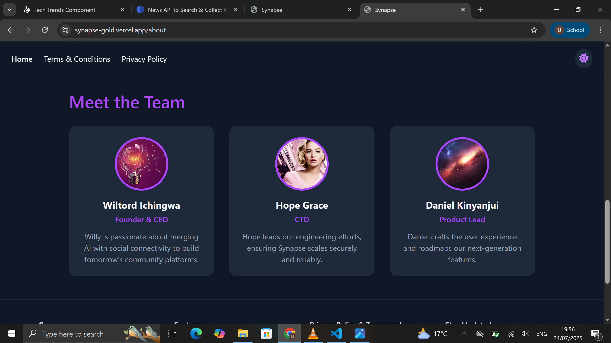<br/>
      <strong>The team</strong>
    </td>
  </tr>
  <tr>
    <td align="center">
      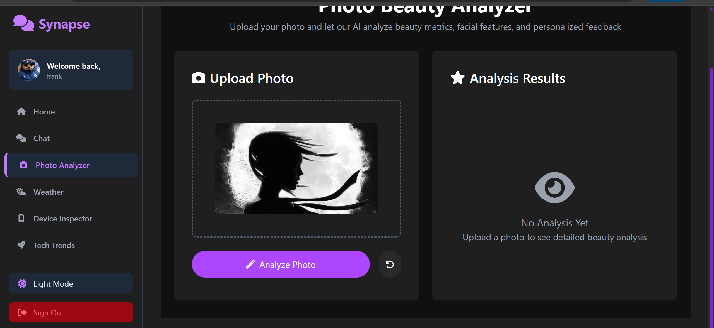<br/>
      <strong>Photo Analysis</strong>
    </td>
    <td align="center">
      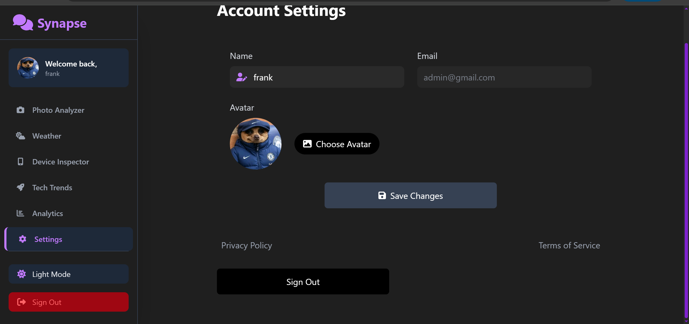<br/>
      <strong>Settings</strong>
    </td>
  </tr>
  <tr>
    <td align="center">
      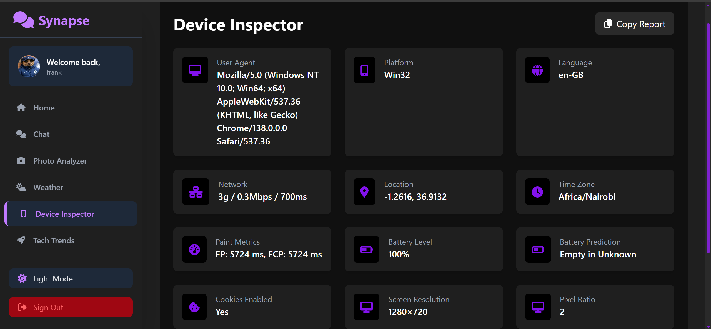<br/>
      <strong>Device Inspector</strong>
    </td>
    <td align="center">
      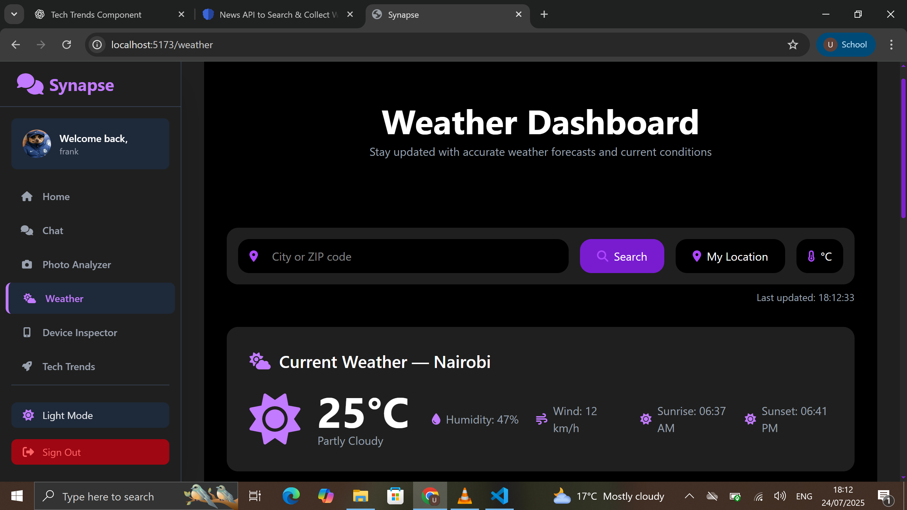<br/>
      <strong>Weather Widget</strong>
    </td>
  </tr>
  <tr>
    <td align="center">
      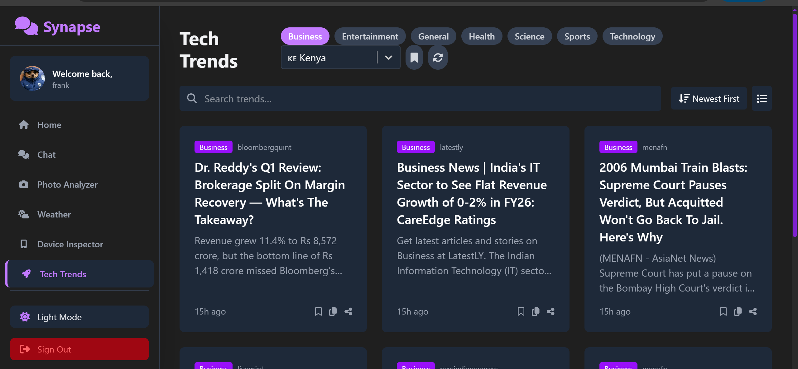<br/>
      <strong>Tech Trends</strong>
    </td>
    <td align="center">
      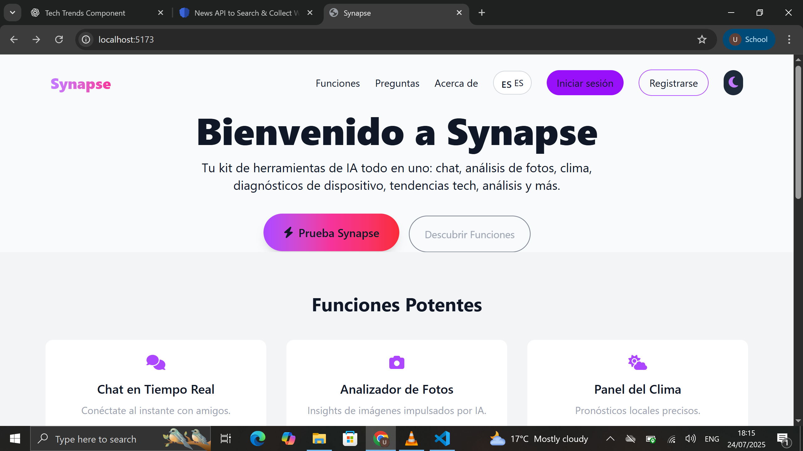<br/>
      <strong>Language Switcher</strong>
    </td>
  </tr>
</table>

---

## ⚙️ Installation

Follow these steps to set up each component:

<details>
<summary>1. Clone the repository</summary>

```bash
# from project root
git clone https://github.com/your-username/synapse.git
cd synapse
```
</details>

<details>
<summary>2. Install and run <strong>Server</strong> (Node.js + Express)</summary>

```bash
cd server
npm install
npm start   # starts backend on configured PORT
```
</details>

<details>
<summary>3. Install and run <strong>Chatbot</strong> (Python)</summary>

```bash
cd chatbot
python -m venv venv        # create virtual environment
# Unix/macOS:
source venv/bin/activate
# Windows:
# venv\Scripts\activate
pip install -r requirements.txt
python bot.py               # starts chatbot service
```
</details>

<details>
<summary>4. Install and run <strong>DeepFace Service</strong> (Python)</summary>

```bash
cd deepface-service
python -m venv venv
source venv/bin/activate    # or Windows activation
pip install -r requirements.txt
python app.py               # launches DeepFace API server
```
</details>

<details>
  <summary>5. Install and run <strong>Client</strong> (React + Vite + Tailwind)</summary>

  ```bash
  cd client
  npm install
  npm run dev  # starts frontend at http://localhost:3000
  ```
</details>

---

## 🌐 Env Variables

**Server** (`./.env`)
```ini
PORT=5000
MONGO_URI=your_mongo_uri
JWT_SECRET=your_jwt_secret
RECAPTCHA_SECRET=your_recaptcha_secret
NEWSDATA_API_KEY=your_newsdata_key
CLIENT_URL=http://localhost:3000
CLOUDINARY_API_KEY=api_key
CLOUDINARY_API_SECRET=your _api_secret
CLOUDINARY_API_NAME=your_name_name

```

**Client** (`/client/.env`)
```ini
VITE_API_URL=http://localhost:5000
VITE_RECAPTCHA_SITE_KEY=your_site_key
```

---

## 🚀 Running the App

**Development:**
```bash
cd server
npm start     # backend
cd client
npm run dev      # frontend
```

**Production:**
```bash
cd client && npm run build
npm run dev
```

---

## 📁 Folder Structure

```text
Synapse/                 # Root project folder
├── docs/                # Documentation and HTML demo
│   ├── index.html       # Full HTML styled README demo
│   └── assets/          # Images used in docs
├── server/              # Backend (Node.js + Express)
│   ├── config/          # CORS, helmet, multer, socket setup
│   ├── controllers/     # Route handlers
│   ├── models/          # Mongoose schemas
│   ├── routes/          # API endpoints (auth, chat, trends, etc.)
│   ├── services/        # External integrations (Newsdata, OpenAI)
│   └── utils/           # Utility functions
├── chatbot/             # AI Chatbot (Python)
│   ├── bot.py           # Main chatbot logic
│   └── requirements.txt # Python dependencies
├── deepface-service/    # Photo analysis microservice (Python)
│   ├── app.py           # DeepFace API server
│   └── requirements.txt
├── client/              # Frontend (React + Vite + Tailwind)
│   ├── public/          # Static assets
│   └── src/             # React source code
├── package.json         # NPM scripts and dependencies
└── README.md            # Project overview
```

---

## 🤝 Contributing

We ❤️ your contributions! Follow these steps to get started:

1. **Fork** the repository
   - Click “Fork” at the top right of this page and clone your copy:
     ```bash
     git clone https://github.com/willy-havertz/synapse.git
     cd synapse
     ```
   <p align="center">
     
   </p>

2. **Create a branch** for your feature or bugfix:
   ```bash
   git checkout -b feature/awesome-feature
   ```
   <p align="center">
     
   </p>

3. **Install dependencies** and run locally:
   ```bash
   npm install       # install backend deps
   cd client && npm install  # install frontend deps
   npm run dev       # start both servers
   ```
   <p align="center">
     
   </p>

4. **Write code**
   - Adhere to existing **code style** (ESLint/Prettier)
   - Add tests under `server/__tests__` or `client/__tests__`
   <p align="center">
     
   </p>

5. **Commit changes** with clear, conventional commit messages:
   ```bash
   git add .
   git commit -m "feat(auth): add social login support"
   ```
   <p align="center">
     
   </p>

6. **Push** to your fork:
   ```bash
   git push origin feature/awesome-feature
   ```
   <p align="center">
     
   </p>

7. **Open a Pull Request**
   - Go to your fork on GitHub and click **Compare & pull request**
   - Fill out the PR template below and link related issues
   <p align="center">
     
   </p>

<details>
<summary>Pull Request Template</summary>

```markdown
## Description

Briefly explain what this PR does and why.

## Related Issue

Closes #<issue_number>

## Type of Change

- [ ] Bug fix
- [ ] New feature
- [ ] Documentation update
- [ ] Tests added

## How Has This Been Tested?

Describe the tests and manual steps you ran.

## Checklist

- [ ] Code follows project style guidelines
- [ ] Self-reviewed my code
- [ ] Added relevant comments
- [ ] Updated documentation if needed
- [ ] Added tests and they pass
```
</details>

8. **Respond to feedback** from reviewers and update your PR.

9. **Get merged!** Once approved, your PR will be merged into `main` and deployed.

---

## 📄 License

Synapse is released under the MIT License. See [LICENSE](LICENSE) for details.
