# Synapse

<p align="center">
  <a href="LICENSE"></a>
  <a href="#"></a>
  <a href="#"></a>
</p>

<p align="center">
  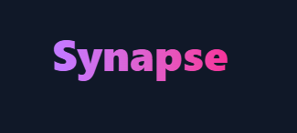
</p>

## Welcome to Synapse

Synapse bridges connections with real‑time chat, AI‑powered photo analysis, trend insights, and personalized analytics—all wrapped in a sleek, responsive interface. Dive in to experience seamless communication, intelligent interactions, and data‑driven decisions.

<details open>
  <summary>📑 Table of Contents</summary>

1. [Features](#features)
2. [Tech Stack](#tech-stack)
3. [Demo](#demo)
4. [Installation](#installation)
5. [Env Variables](#env-variables)
6. [Running the App](#running-the-app)
7. [Folder Structure](#folder-structure)
8. [Contributing](#contributing)
9. [License](#license)
</details>

---

## Features

- 🔐 **Secure Auth**: JWT + Google reCAPTCHA v2
- 💬 **Real‑time Chat**: 1:1 & group via `Socket.io`
- 🤖 **AI Chatbot**: GPT‑powered contextual conversations
- 🖼️ **DeepFace Analysis**: Photo face recognition & attributes
- 📈 **Analytics**: Recharts dashboard
- 🌐 **i18n**: Multi‑language via i18next
- 🎨 **Theme Toggle**: Persistent dark/light mode
- 📬 **Password Reset**: Email workflow
- ⚡️ **PWA Ready**: Offline caching & SEO

---

## Tech Stack

| Layer    | Technology                                                                      |
| -------- | ------------------------------------------------------------------------------- |
| Frontend | ``React``  ``Tailwind``  ``Vite``  ``Axios``  ``react-hot-toast``  ``Framer Motion``  ``FontAwesome`` |
| Backend  | ``Node.js``  ``Express``  `Socket.io`                                                 |
| AI       | ``OpenAI GPT``  ``DeepFace.js``                                                        |
| DB       | ``MongoDB``  ``Mongoose``                                                              |
| Auth     | ``JWT``  ``Google reCAPTCHA``                                                          |
| Charts   | ``Recharts``  ``react-countup``                                                        |
| i18n     | ``i18next``  ``react-i18next``                                                         |
| Deploy   | ``Vercel``  ``Render``                                                                 |

---

## Demo

<p align="center">Click the image to see the live site</p>
<p align="center">
  <a href="https://synapse-gold.vercel.app"></a>
</p>

---

## Screenshots

<table>
  <tr>
    <td align="center">
      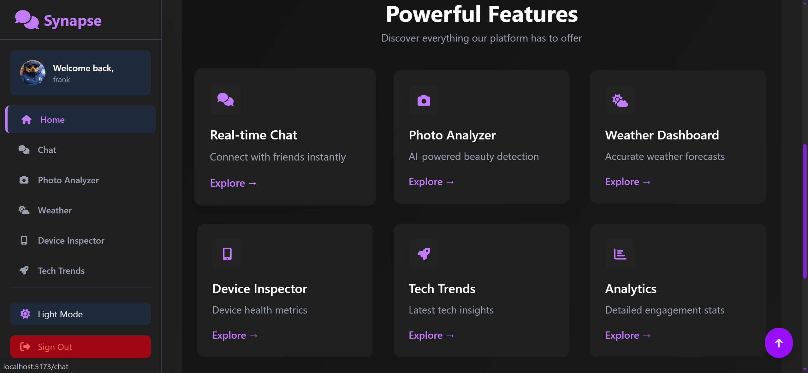<br/>
      <strong>Home Dashboard</strong>
    </td>
    <td align="center">
      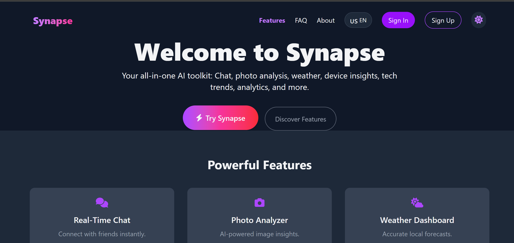<br/>
      <strong>Landing Page</strong>
    </td>
    <td align="center">
      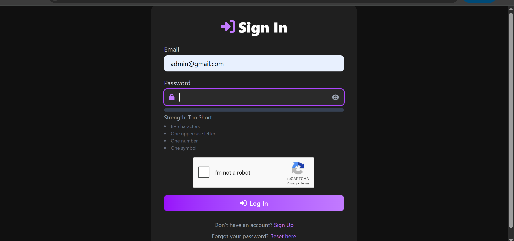<br/>
      <strong>Login</strong>
    </td>
  </tr>
  <tr>
    <td align="center">
      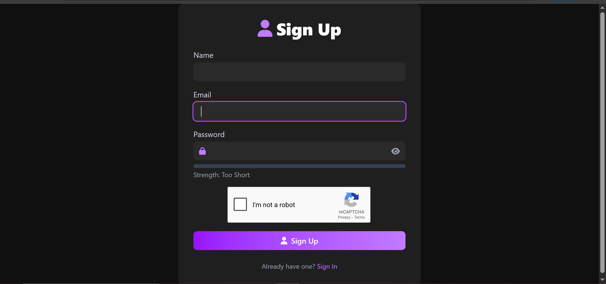<br/>
      <strong>Analytics</strong>
    </td>
    <td align="center">
      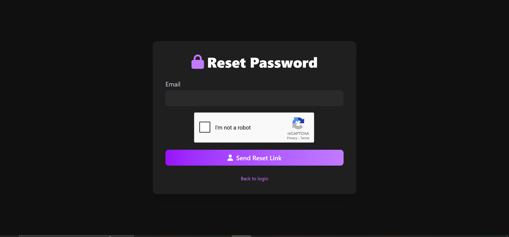<br/>
      <strong>Reset</strong>
    </td>
    <td align="center">
      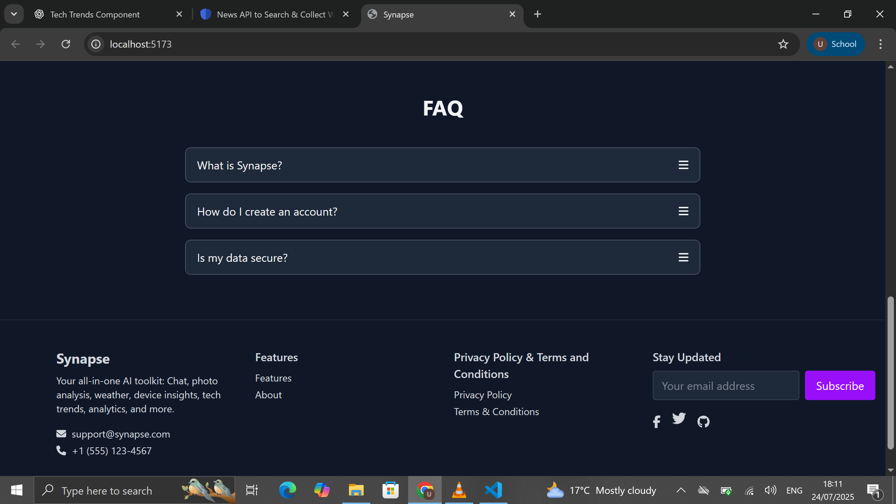<br/>
      <strong>Footer</strong>
    </td>
  </tr>
  <tr>
    <td align="center">
      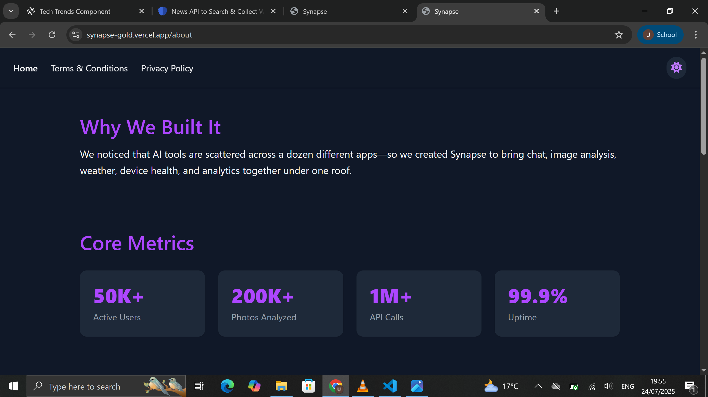<br/>
      <strong>About</strong>
    </td>
    <td align="center">
      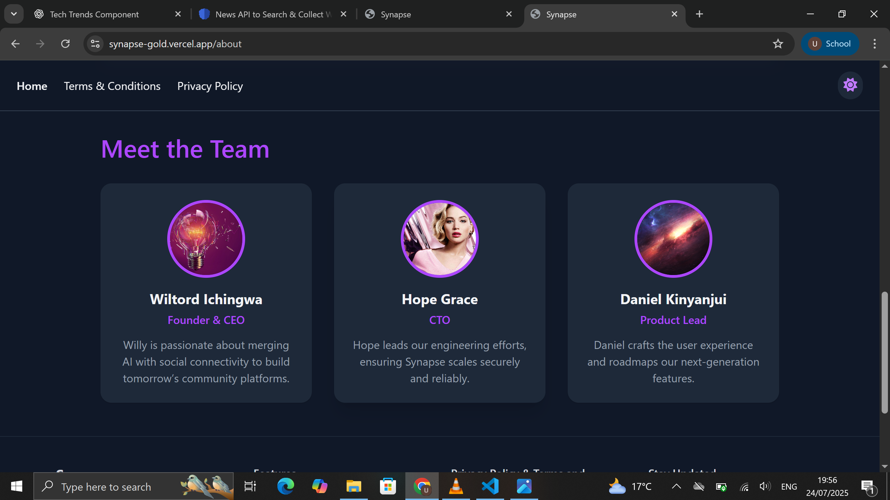<br/>
      <strong>The Team</strong>
    </td>
    <td align="center">
      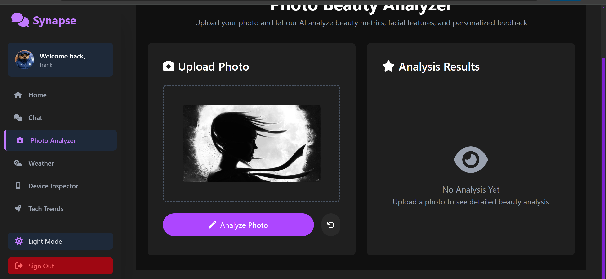<br/>
      <strong>Photo Analysis</strong>
    </td>
  </tr>
  <tr>
    <td align="center">
      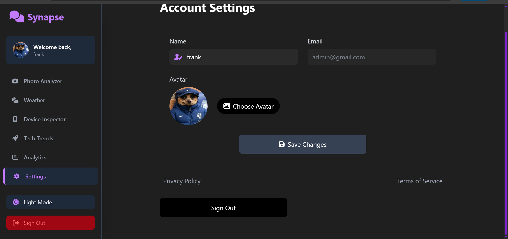<br/>
      <strong>Settings</strong>
    </td>
    <td align="center">
      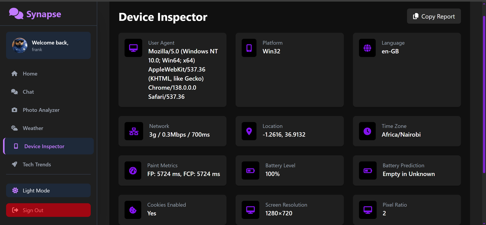<br/>
      <strong>Device Inspector</strong>
    </td>
    <td align="center">
      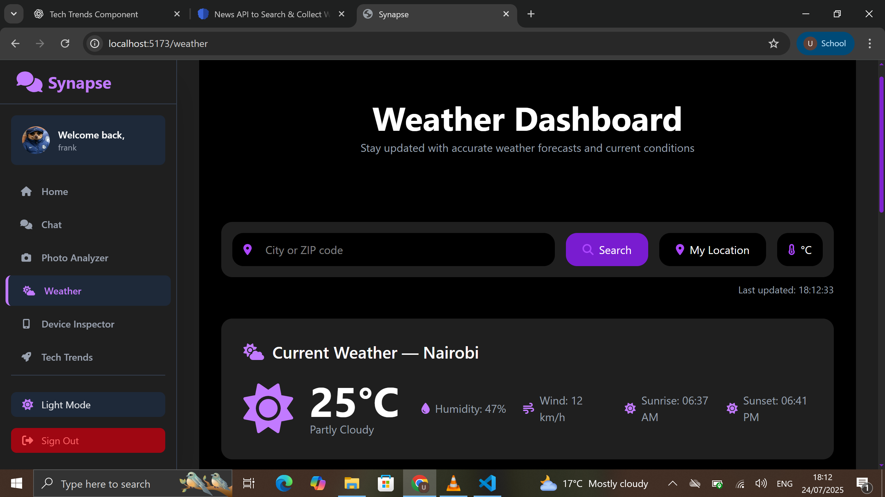<br/>
      <strong>Weather Widget</strong>
    </td>
  </tr>
  <tr>
    <td align="center">
      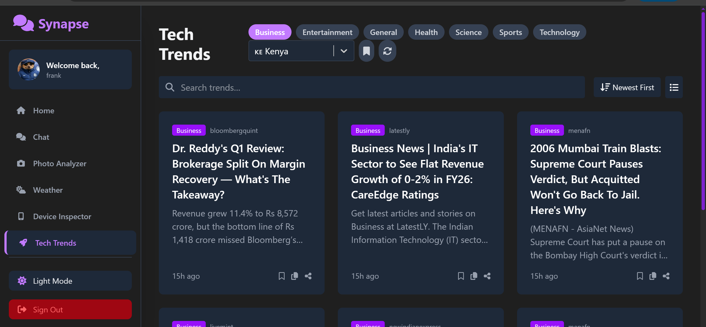<br/>
      <strong>Tech Trends</strong>
    </td>
    <td align="center">
      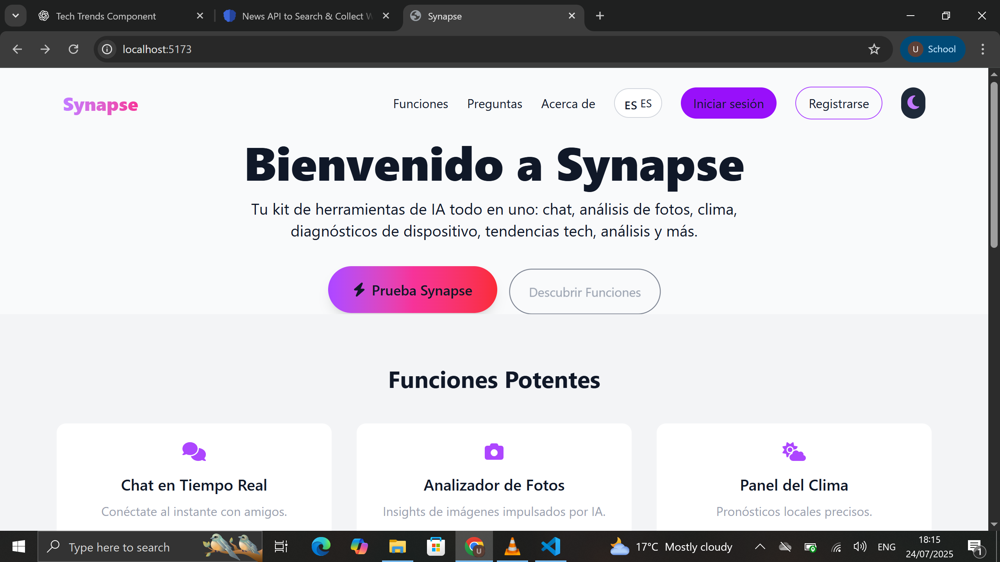<br/>
      <strong>Language Switcher</strong>
    </td>
    <td align="center">
      <br/>
      <strong>Synapse</strong>
    </td>
  </tr>
</table>

---

## Installation

```bash
# Clone the repository
git clone https://github.com/your-username/synapse.git
cd synapse
```

---

<details>
<summary>1. Install and run <strong>Server</strong> (Node.js + Express) </summary>

```bash
cd server
npm install
npm start   # starts backend on configured PORT
```

</details>

<details>
<summary>2. Install and run <strong>Chatbot</strong> (Python)</summary>

```bash
cd chatbot
python -m venv venv        # create virtual environment
# Unix/macOS:
source venv/bin/activate
# Windows:
# venv\Scripts\activate
pip install -r requirements.txt
python bot.py               # starts chatbot service
```

</details>

<details>
<summary>3. Install and run <strong>DeepFace Service</strong> (Python)</summary>

```bash
cd deepface-service
python -m venv venv
source venv/bin/activate    # or Windows activation
pip install -r requirements.txt
python app.py               # launches DeepFace API server
```

</details>

<details>
  <summary>4. Install and run <strong>Client</strong> (React + Vite + Tailwind)</summary>

```bash
cd client
npm install
npm run dev  # starts frontend at http://localhost:3000
```

</details>

---

## Env Variables

**Server** (`./.env`)

```ini
PORT=5000
MONGO_URI=your_mongo_uri
JWT_SECRET=your_jwt_secret
RECAPTCHA_SECRET=your_recaptcha_secret
NEWSDATA_API_KEY=your_newsdata_key
CLIENT_URL=http://localhost:3000
CLOUDINARY_API_KEY=api_key
CLOUDINARY_API_SECRET=your _api_secret
CLOUDINARY_API_NAME=your_name_name

```

**Client** (`/client/.env`)

```ini
VITE_API_URL=http://localhost:5000
VITE_RECAPTCHA_SITE_KEY=your_site_key
```

---

## Running the App

**Development:**

```bash
cd server
npm start     # backend
cd client
npm run dev      # frontend
```

**Production:**

```bash
cd client && npm run build
npm run dev
```

---

## Folder Structure

```text
Synapse/                 # Root project folder
├── docs/                # Documentation and HTML demo
│   ├── index.html       # Full HTML styled README demo
│   └── assets/          # Images used in docs
├── server/              # Backend (Node.js + Express)
│   ├── config/          # CORS, helmet, multer, socket setup
│   ├── controllers/     # Route handlers
│   ├── models/          # Mongoose schemas
│   ├── routes/          # API endpoints (auth, chat, trends, etc.)
│   ├── services/        # External integrations (Newsdata, OpenAI)
│   └── utils/           # Utility functions
├── chatbot/             # AI Chatbot (Python)
│   ├── bot.py           # Main chatbot logic
│   └── requirements.txt # Python dependencies
├── deepface-service/    # Photo analysis microservice (Python)
│   ├── app.py           # DeepFace API server
│   └── requirements.txt
├── client/              # Frontend (React + Vite + Tailwind)
│   ├── public/          # Static assets
│   └── src/             # React source code
├── package.json         # NPM scripts and dependencies
└── README.md            # Project overview
```

---

## Contributing

We ❤️ your contributions! Follow these steps to get started:

1. **Fork** the repository

   - Click “Fork” at the top right of this page and clone your copy:
     ```bash
     git clone https://github.com/willy-havertz/synapse.git
     cd synapse
     ```
     <p align="center">
       
     </p>

2. **Create a branch** for your feature or bugfix:

   ```bash
   git checkout -b feature/awesome-feature
   ```

   <p align="center">
     
   </p>

3. **Install dependencies** and run locally:

   ```bash
   npm install       # install backend deps
   cd client && npm install  # install frontend deps
   npm run dev       # start both servers
   ```

   <p align="center">
     
   </p>

4. **Write code**

   - Adhere to existing **code style** (ESLint/Prettier)
   - Add tests under `server/__tests__` or `client/__tests__`
   <p align="center">
     
   </p>

5. **Commit changes** with clear, conventional commit messages:

   ```bash
   git add .
   git commit -m "feat(auth): add social login support"
   ```

   <p align="center">
     
   </p>

6. **Push** to your fork:

   ```bash
   git push origin feature/awesome-feature
   ```

   <p align="center">
     
   </p>

7. **Open a Pull Request**
   - Go to your fork on GitHub and click **Compare & pull request**
   - Fill out the PR template below and link related issues
   <p align="center">
     
   </p>

    <p>
    <summary>Pull Request Template</summary>

    ```markdown
    ## Description

    Briefly explain what this PR does and why.

    ## Related Issue

    Closes #<issue_number>

    ## Type of Change

    - [ ] Bug fix
    - [ ] New feature
    - [ ] Documentation update
    - [ ] Tests added

    ## How Has This Been Tested?

    Describe the tests and manual steps you ran.

    ## Checklist

    - [ ] Code follows project style guidelines
    - [ ] Self-reviewed my code
    - [ ] Added relevant comments
    - [ ] Updated documentation if needed
    - [ ] Added tests and they pass
    ```

    </p>

8. **Respond to feedback** from reviewers and update your PR.

9. **Get merged!** Once approved, your PR will be merged into `main` and deployed.

---

## License

Synapse is released under the MIT License. See [LICENSE](LICENSE) for details.
