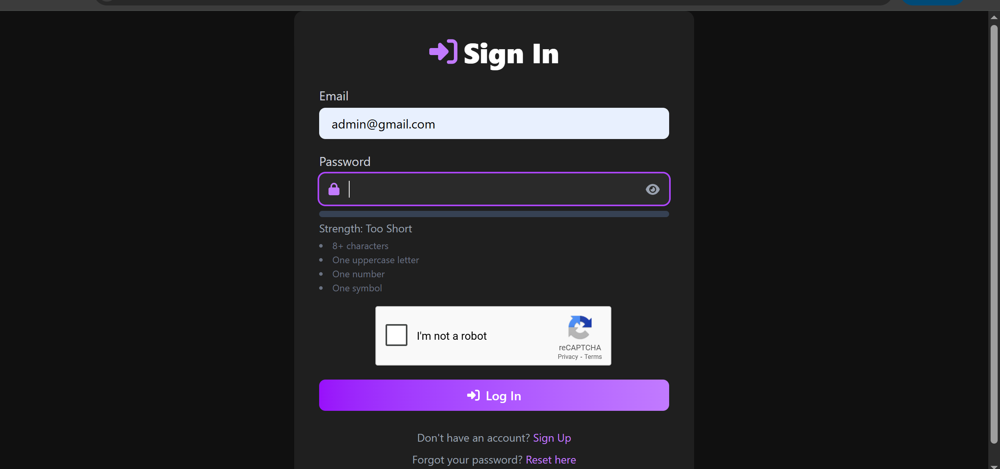
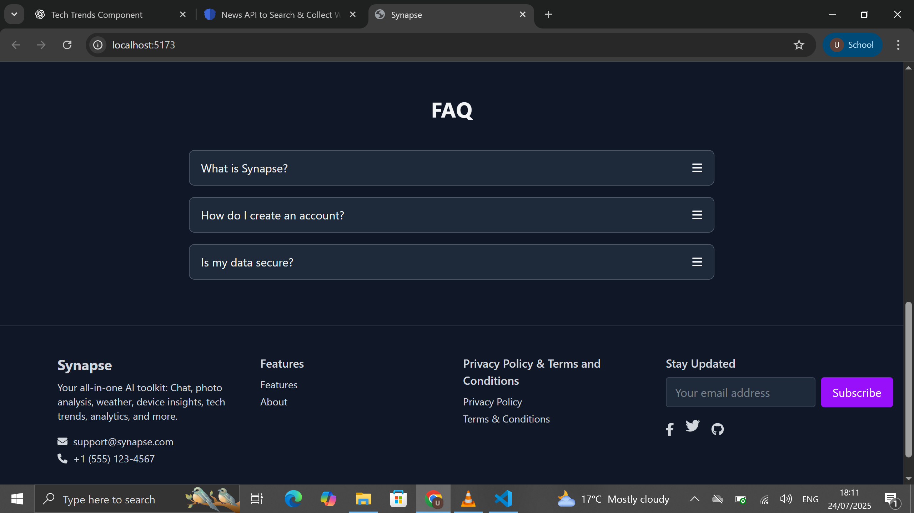

# Synapse

<p align="center">
  <a href="LICENSE"></a>
  <a href="#"></a>
  <a href="#"></a>
</p>

<p align="center">
  
</p>

## Welcome to *Synapse*

Synapse bridges connections with real‑time chat, AI‑powered photo analysis, trend insights, and personalized analytics—all wrapped in a sleek, responsive interface. Dive in to experience seamless communication, intelligent interactions, and data‑driven decisions.

<details open>
  <summary>📑 Table of Contents</summary>

  1. [Features](#🚀-features)  
  2. [Tech Stack](#🛠-tech-stack)  
  3. [Demo](#🎬-demo)   
  4. [Installation](#⚙️-installation)  
  5. [Env Variables](#env-variables)  
  6. [Running the App](#running-the-app)  
  7. [Folder Structure](#folder-structure)  
  8. [Contributing](#contributing)  
  9. [License](#license)  
</details>

---

## 🚀 Features

- 🔐 **Secure Auth**: JWT + Google reCAPTCHA v2  
- 💬 **Real‑time Chat**: 1:1 & group via Socket.io  
- 🤖 **AI Chatbot**: GPT‑powered contextual conversations  
- 🖼️ **DeepFace Analysis**: Photo face recognition & attributes  
- 📈 **Analytics**: Recharts dashboard  
- 🌐 **i18n**: Multi‑language via i18next  
- 🎨 **Theme Toggle**: Persistent dark/light mode  
- 📬 **Password Reset**: Email workflow  
- ⚡️ **PWA Ready**: Offline caching & SEO  

---

## 🛠 Tech Stack

| Layer     | Technology                                                                 |
|-----------|----------------------------------------------------------------------------|
| Frontend  | React · Tailwind · Vite · Axios · react-hot-toast · Framer Motion · FontAwesome |
| Backend   | Node.js · Express · Socket.io                                               |
| AI        | OpenAI GPT · DeepFace.js                                                    |
| DB        | MongoDB · Mongoose                                                          |
| Auth      | JWT · Google reCAPTCHA                                                      |
| Charts    | Recharts · react-countup                                                    |
| i18n      | i18next · react-i18next                                                     |
| Deploy    | Vercel · Render                                                             |

---

## 🎬 Demo
<p align="center">Click the image to see the live site</p>
<p align="center">
  <a href="https://synapse-gold.vercel.app"></a>
</p>

---

## 📸 Screenshots

<table>
  <tr>
    <td align="center">
      <br/>
      <strong>Home Dashboard</strong>
    </td>
    <td align="center">
      <br/>
      <strong>Landing Page</strong>
    </td>
    <td align="center">
      <br/>
      <strong>Login</strong>
    </td>
  </tr>
  <tr>
    <td align="center">
      <br/>
      <strong>Analytics</strong>
    </td>
    <td align="center">
      <br/>
      <strong>Reset</strong>
    </td>
    <td align="center">
      <br/>
      <strong>Footer</strong>
    </td>
  </tr>
  <tr>
    <td align="center">
      <br/>
      <strong>About</strong>
    </td>
    <td align="center">
      <br/>
      <strong>The Team</strong>
    </td>
    <td align="center">
      <br/>
      <strong>Photo Analysis</strong>
    </td>
  </tr>
  <tr>
    <td align="center">
      <br/>
      <strong>Settings</strong>
    </td>
    <td align="center">
      <br/>
      <strong>Device Inspector</strong>
    </td>
    <td align="center">
      <br/>
      <strong>Weather Widget</strong>
    </td>
  </tr>
  <tr>
    <td align="center">
      <br/>
      <strong>Tech Trends</strong>
    </td>
    <td align="center">
      <br/>
      <strong>Language Switcher</strong>
    </td>
    <td align="center">
      &mdash;
    </td>
  </tr>
</table>


---

## ⚙️ Installation

```bash
# Clone the repository
git clone https://github.com/your-username/synapse.git
cd synapse
```

---

<details>
<summary>2. Install and run <strong>Server</strong> (Node.js + Express) </summary>

```bash
cd server
npm install
npm start   # starts backend on configured PORT
```
</details>

<details>
<summary>2. Install and run <strong>Server/strong> (Node.js + Express)</summary>

```bash
cd server
npm install   
npm start
```
</details>
<details>
<summary>3. Install and run <strong>Chatbot</strong> (Python)</summary>

```bash
cd chatbot
python -m venv venv        # create virtual environment
# Unix/macOS:
source venv/bin/activate
# Windows:
# venv\Scripts\activate
pip install -r requirements.txt
python bot.py               # starts chatbot service
```
</details>

<details>
<summary>4. Install and run <strong>DeepFace Service</strong> (Python)</summary>

```bash
cd deepface-service
python -m venv venv
source venv/bin/activate    # or Windows activation
pip install -r requirements.txt
python app.py               # launches DeepFace API server
```
</details>

<details>
  <summary>5. Install and run <strong>Client</strong> (React + Vite + Tailwind)</summary>

  ```bash
  cd client
  npm install
  npm run dev  # starts frontend at http://localhost:3000
  ```
</details>

---

## 🌐 Env Variables

**Server** (`./.env`)
```ini
PORT=5000
MONGO_URI=your_mongo_uri
JWT_SECRET=your_jwt_secret
RECAPTCHA_SECRET=your_recaptcha_secret
NEWSDATA_API_KEY=your_newsdata_key
CLIENT_URL=http://localhost:3000
CLOUDINARY_API_KEY=api_key
CLOUDINARY_API_SECRET=your _api_secret
CLOUDINARY_API_NAME=your_name_name

```

**Client** (`/client/.env`)
```ini
VITE_API_URL=http://localhost:5000
VITE_RECAPTCHA_SITE_KEY=your_site_key
```

---

## 🚀 Running the App

**Development:**
```bash
cd server
npm start     # backend
cd client
npm run dev      # frontend
```

**Production:**
```bash
cd client && npm run build
npm run dev
```

---

## 📁 Folder Structure

```text
Synapse/                 # Root project folder
├── docs/                # Documentation and HTML demo
│   ├── index.html       # Full HTML styled README demo
│   └── assets/          # Images used in docs
├── server/              # Backend (Node.js + Express)
│   ├── config/          # CORS, helmet, multer, socket setup
│   ├── controllers/     # Route handlers
│   ├── models/          # Mongoose schemas
│   ├── routes/          # API endpoints (auth, chat, trends, etc.)
│   ├── services/        # External integrations (Newsdata, OpenAI)
│   └── utils/           # Utility functions
├── chatbot/             # AI Chatbot (Python)
│   ├── bot.py           # Main chatbot logic
│   └── requirements.txt # Python dependencies
├── deepface-service/    # Photo analysis microservice (Python)
│   ├── app.py           # DeepFace API server
│   └── requirements.txt
├── client/              # Frontend (React + Vite + Tailwind)
│   ├── public/          # Static assets
│   └── src/             # React source code
├── package.json         # NPM scripts and dependencies
└── README.md            # Project overview
```

---

## 🤝 Contributing

We ❤️ your contributions! Follow these steps to get started:

1. **Fork** the repository
   - Click “Fork” at the top right of this page and clone your copy:
     ```bash
     git clone https://github.com/willy-havertz/synapse.git
     cd synapse
     ```
   <p align="center">
     
   </p>

2. **Create a branch** for your feature or bugfix:
   ```bash
   git checkout -b feature/awesome-feature
   ```
   <p align="center">
     
   </p>

3. **Install dependencies** and run locally:
   ```bash
   npm install       # install backend deps
   cd client && npm install  # install frontend deps
   npm run dev       # start both servers
   ```
   <p align="center">
     
   </p>

4. **Write code**
   - Adhere to existing **code style** (ESLint/Prettier)
   - Add tests under `server/__tests__` or `client/__tests__`
   <p align="center">
     
   </p>

5. **Commit changes** with clear, conventional commit messages:
   ```bash
   git add .
   git commit -m "feat(auth): add social login support"
   ```
   <p align="center">
     
   </p>

6. **Push** to your fork:
   ```bash
   git push origin feature/awesome-feature
   ```
   <p align="center">
     
   </p>

7. **Open a Pull Request**
   - Go to your fork on GitHub and click **Compare & pull request**
   - Fill out the PR template below and link related issues
   <p align="center">
     
   </p>

<details>
<summary>Pull Request Template</summary>

```markdown
## Description

Briefly explain what this PR does and why.

## Related Issue

Closes #<issue_number>

## Type of Change

- [ ] Bug fix
- [ ] New feature
- [ ] Documentation update
- [ ] Tests added

## How Has This Been Tested?

Describe the tests and manual steps you ran.

## Checklist

- [ ] Code follows project style guidelines
- [ ] Self-reviewed my code
- [ ] Added relevant comments
- [ ] Updated documentation if needed
- [ ] Added tests and they pass
```
</details>

8. **Respond to feedback** from reviewers and update your PR.

9. **Get merged!** Once approved, your PR will be merged into `main` and deployed.

---

## 📄 License

Synapse is released under the MIT License. See [LICENSE](LICENSE) for details.
